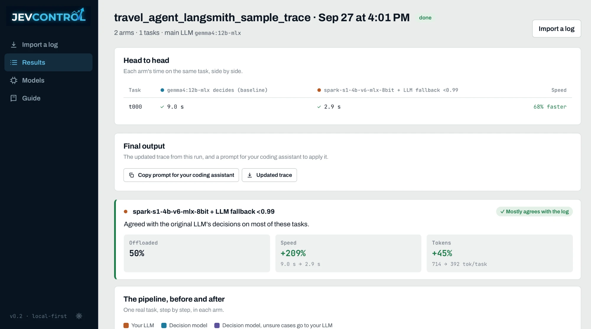

<p align="center">
  
</p>

<p align="center">
  
  <br /><sub>Part of <b>Nokast</b>, an open-source AI community</sub>
</p>

## What is JevControl?

**Find out whether a smaller model could handle some of your AI agent's routine choices.**

An AI agent does more than write answers. It also makes small choices along the way: "Should I search
again?", "Which tool should I use?", or "Is there enough information to respond?" JevControl helps you
find those choices and test whether a smaller model can handle them while your main model keeps writing
the final answer.

Import a record of an agent run from LangSmith, Langfuse, or OpenTelemetry. JevControl shows what happened
step by step and highlights choices worth reviewing. You decide which ones to test. Then you can compare
the original approach with a test run using a smaller model.

You stay in control: JevControl does not change your production agent. Importing and reviewing a trace
requires no model. Running a comparison requires access to the models you want to test.

## See an example

A travel agent gets this request: "Plan a three-night trip to Seattle. Don't book anything yet." It might
search flights, check hotels, decide whether the options meet the budget, and write a response. JevControl
could test a smaller model on a bounded choice such as *search again / show options / ask a question*. The
main model still writes the travel plan; the agent's booking rules still apply.

<p align="center">
  
</p>

What you'll see: the original steps, the steps tested with a smaller model, and the observed differences
in time, model calls, tokens, and cost where those measurements are available. If you provide task scores,
JevControl can also compare quality on those tasks.

## Try a sample

```bash
python -m venv .venv && . .venv/bin/activate
pip install -e ".[dev]"
(cd frontend && npm install && npm run build)     # builds the UI into jevcontrol/webui

jevcontrol serve                                   # open http://localhost:8600
```

Or with Docker — no local Python/Node setup at all:

```bash
docker run -p 8600:8600 -v jevcontrol-data:/data ghcr.io/abhishek085/jevcontrol:latest
```

Either way, open http://localhost:8600, go to the Import page, and under "Preview only" click
**`shopping_agent_run_tree.json`** — a bundled sample trace. JevControl reconstructs it step by step with
no model required. When you're ready to test a decision for real, add a model on the Models page (or point
at one you already run) and click Analyze.

## Use your own agent

Give JevControl a trace of your agent actually running:

- **A run-tree export** — LangSmith, Langfuse, or OpenTelemetry (OTLP). One export previews a single run;
  load several exports from the same agent to compare on more than one task. A run-tree's own input/output
  isn't guaranteed to be a resendable prompt across export formats, so only the decision steps you agree to
  test are replayed — writing and tool-call steps stay exactly as logged, never resent.
- **A plain call log** — one JSONL line per LLM call (prompt + reply). JevControl replays the whole
  pipeline, including writing steps, using your own logged prompt as the baseline's exact original call.

Either way, JevControl finds the steps that look like a decision — a closed set of options — rather than
open-ended writing, and asks you to agree or disagree with each one before anything is tested. See
[docs/TRACES.md](docs/TRACES.md) for the full detail on what each format can and can't reconstruct.

## Understand the results

**Preview vs. rerun.** Importing and reviewing a trace is a preview: JevControl reads what already
happened and proposes changes, without calling any model. Running a comparison is a real rerun: the same
task goes through your main LLM deciding by prompting, and through a decision model, with real latency,
tokens and answers measured both ways.

**When accuracy claims need ground truth.** Without it, JevControl can only tell you whether the decision
model agreed with what your LLM originally decided — a fidelity measure, not a correctness one; a
disagreement is a case to look at, not necessarily a mistake. Give your tasks an expected answer (or a
`score()` function) for a real accuracy claim with a confidence interval. A few other things worth
knowing: latency depends on your hardware and whatever else is using it (runs are sequential by default so
arms stay comparable); small task sets give wide, honestly-labelled "not proven" intervals; and a decision
that changes *which* tool runs produces a new, live call rather than a replayed one. See
[docs/METHOD.md](docs/METHOD.md) for the statistics behind all of this.

## For developers

**CLI**: `jevcontrol probe <url> --model <name>` checks an endpoint (logprobs required for a decision
model); `jevcontrol run experiment.yaml` runs the same engine as the UI, headless; `jevcontrol trace
calls.jsonl --price-in 0.15 --price-out 0.60` projects savings from a call log without opening the app.

**Endpoints & model serving**: a decision model can be reached three ways — an OpenAI-compatible endpoint
with logprobs (the answer is read from the first token's distribution, which is what gives calibrated
confidence), the same chat API without logprobs (an answer, but nothing to threshold), or a Jev-style typed
decision API that returns its own probabilities. The main LLM is always a plain chat endpoint. Pull any
Hugging Face repo and serve it with vLLM from the Models page (Linux + NVIDIA GPU only), or point
JevControl at any endpoint you already run or pay for — "decision model" is a job you give something, not
a property JevControl checks. See [docs/MODELS.md](docs/MODELS.md).

**Logprobs, precisely**: a decision is rendered as a closed menu; the first token the model generates is
read out of the top-20 logprobs and renormalised into a full probability distribution — one forward pass
per decision. Details in [docs/MODELS.md](docs/MODELS.md).

**Architecture**: `jevcontrol/core` is the engine (menu readout, deciders, harness loader, tool replay,
runner, statistics); `jevcontrol/server` is a FastAPI app plus a local model hub; `frontend/` is a Vite +
React + TypeScript UI. See [docs/DESIGN.md](docs/DESIGN.md).

**Docker**: `docker build -t jevcontrol .` builds the image locally (see `Dockerfile`); `JEVCONTROL_HOME`
(`/data`) and `JEVCONTROL_MODELS` (`/models`) are the two volumes worth persisting. The Models page's own
**Serve** button starts a model in a Docker container on the *host* and needs Linux + an NVIDIA GPU + the
host's Docker socket, none of which the JevControl container itself has — point it at an external endpoint
instead when running this way.

**Security**: the app binds to `127.0.0.1` with no authentication, and can start Docker containers and
import the harness file you point it at (arbitrary Python) — treat it like a local dev tool, not something
to expose to a network.

**More docs**: [docs/METHOD.md](docs/METHOD.md) (statistics and what the numbers can and cannot claim),
[docs/TRACES.md](docs/TRACES.md) (importing a trace or log in depth), [docs/MODELS.md](docs/MODELS.md)
(serving and connecting models), [docs/HARNESS.md](docs/HARNESS.md) (writing a harness by hand, for the CLI
path), [docs/DESIGN.md](docs/DESIGN.md) (why each measurement is set up the way it is).

## Disclaimer

JevControl is an independent, open-source project. It is not affiliated with TypeSafe AI or NVIDIA. Jev and System One are TypeSafe AI's names; open-spark-Jev is an independent implementation inspired by them. NVIDIA, DGX Spark and TensorRT-LLM are NVIDIA products.

## License

Apache-2.0. See [LICENSE](LICENSE).
